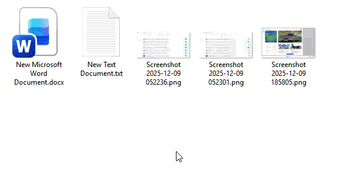

# 📁 Move To New Folder

A lightweight Windows utility that moves multiple selected files into a newly created folder directly from the Windows Explorer context menu.  This tool is designed for users who frequently organize large sets of files and want a fast, silent, and reliable way to group them without repetitive manual steps.

✨ Key Features
- One‑click execution directly from the Windows Explorer context menu
- Automatically creates a new folder and moves all selected files into it
- Fast, silent, and reliable—ideal for batch processing
- Perfect for organizing downloads, project assets, documents, and more
- Simple setup with minimal configuration required

🛠️ How It Works

Select any number of files in Windows Explorer, right‑click, and choose the custom context‑menu command. The program instantly generates a new folder (based on your preferred naming logic) and moves all selected files into it.

🎯 Purpose

This tool is built to speed up everyday workflows, reduce clutter, and provide a clean, automated approach to file management, especially useful for users who frequently handle large batches of files.

🧩 How It Works
1. Select multiple files in Windows Explorer.
2. Right‑click and choose the custom context‑menu command.
3. The program creates a new folder in the same directory.
4. All selected files are moved into that folder automatically.

📦 Installation
1. Copy the executable/script to a permanent location.
2. Add a context‑menu entry via the Windows Registry (instructions or .reg file can be included in the repo).
3. Refresh Explorer or restart your session.
4. Right‑click any group of files to start using the tool.

📚 Example Use Cases
- Grouping downloaded images into a single folder
- Organizing project assets during development
- Cleaning up cluttered directories
- Preparing files for upload or archiving

🤝 Contributing

Contributions, suggestions, and improvements are welcome. Feel free to open issues or submit pull requests.

📄 License

Apache‑2.0
